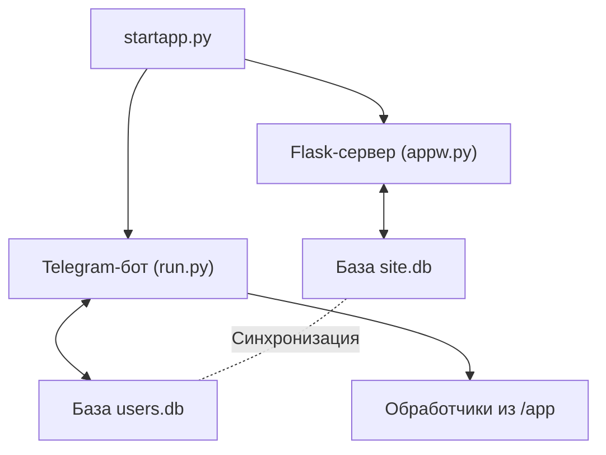

# schMangr

# Проект: Учебный бот и веб-интерфейс

Проект представляет собой многофункционального Telegram-бота с веб-интерфейсом, предназначенного для образовательного процесса. 
Система поддерживает роли **ученика**, **учителя** и **администратора**, интегрирована с базой данных и Flask-сайтом.

---

## 🗂 Структура проекта

### 📁 Папка `app` (Основной функционал бота)
| Файл | Описание |
|------|----------|
| `funny_handlers.py` | *[В разработке]* Обработчик неформальных сообщений вне диалога |
| `handlers_stud.py` | Функционал ученика: расписание и тд |
| `handlers_teacher.py` | Функционал учителя: управление классами и тд |
| `handlers.py` | Базовые команды (`/start`, навигация) |
| `help_hand.py` | Система помощи (загрузка/отправка документации) |
| `hoper_handlers.py` | **Админ-панель**: расширенные привилегии создателя |
| `keyboards.py` | Генератор интерактивных клавиатур |

### 📁 Папка `data`
| Файл | Назначение |
|------|------------|
| `helping.docx` | Основной файл документации для пользователей |

### 📁 Папка `instance`
| Файл | Описание |
|------|----------|
| `site.db` | **База данных сайта**: - Таблица `class_schedule` (расписания) - Таблица `user` (данные веб-пользователей) |

### 📁 Папка `templates`
- HTML-шаблоны и CSS-стили для веб-интерфейса

### 📁 Папка `uploads`
- *[Зарезервировано]* Для хранения пользовательских загрузок

---

## 🖥 Основные файлы проекта

### 🌐 Веб-часть
| Файл | Роль |
|------|------|
| `appw.py` | **Главный файл Flask-приложения** (роутинг, логика сайта) |
| `templates/` | Шаблоны веб-страниц со стилями |

### 🤖 Telegram-бот
| Файл | Роль |
|------|------|
| `run.py` | Ядро бота (инициализация, обработка событий) |
| `config.py` | Конфигурационные константы (токены, пути) |
| `users.db` | База данных пользователей бота |

### ⚙️ Системные файлы
| Файл | Назначение |
|------|------------|
| `startapp.py` | **Точка входа**: параллельный запуск бота и веб-сервера |
| `amvera.yml` | Конфигурация для деплоя на Amvera |
| `requirements.txt` | Список зависимостей Python |

---

## 🔄 Взаимодействие компонентов

ГЛАВНОЕ!!!
#app.run(host='0.0.0.0', port=5000)
serve(app, host='0.0.0.0', port=8080, threads=4)
ЭТОТ ФРАГМЕНТ ЗАМЕНИТЬ НА ДЛЯ ЗАПУСКА НА ЛОКАЛЬНОМ АДРЕСЕ! в ДВУХ файлах в конце APPW.PY и в STARTAPP.PY (Там будет две закомментирвоанные строчки выберите ту которая с портом 5000)
app.run(host='0.0.0.0', port=5000)
#serve(app, host='0.0.0.0', port=8080, threads=4)

## Запуск проекта  
Установите зависимости
pip install -r requirements.txt

Запустите основное приложение:
python startapp.py

⚠️ Особенности
Базы users.db (бот) и site.db (веб) синхронизируются по логике приложения

Для доступа к админ-функциям в боте требуется специальная аутентификация

Файл funny_handlers.py требует доработки для активации|

